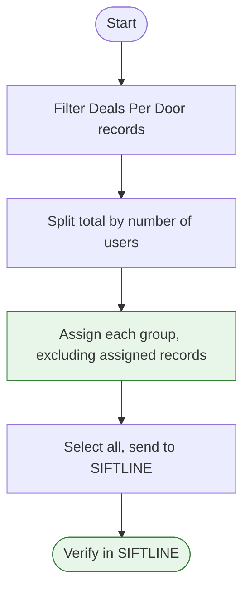
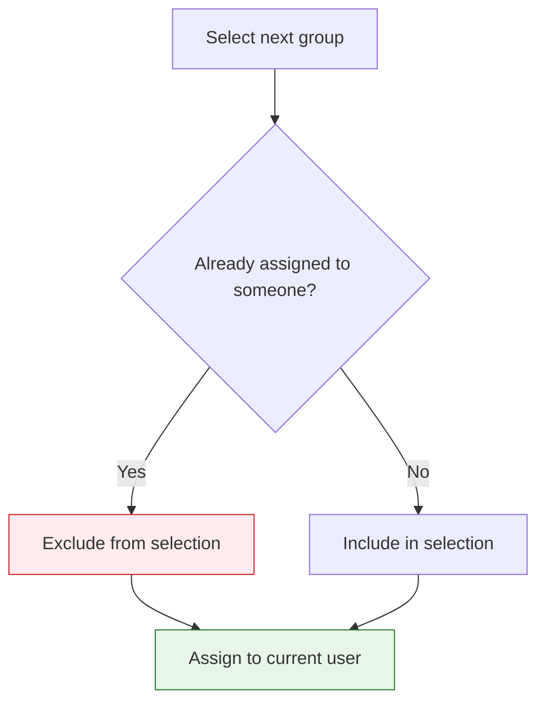

# Assigning Deals Per Door Records to Users

**SOP**

---

## Purpose & Overview

This SOP shows how to split a batch of Deals Per Door records into equal groups, assign each group to a team member, and move the whole batch into SIFTLINE. Doing this the right way stops the same record from going to two people at once.

**Purpose:** Give each caller their own set of Deals Per Door records with no overlap, then send the full batch to SIFTLINE.

**How:** Filter the records, split the total by headcount, assign one group at a time while excluding records already given out, then push everything to SIFTLINE together.

---

## Process Map



Here's how each step works in detail.

---

## What You Need

### Tools & Access

| Tool | What It's For | How to Get It |
|------|---------------|----------------|
| DataSift (REISift) login | Filter and assign records | Ask your admin for account access |
| Records page permissions | Bulk select and bulk assign | Comes with your DataSift login |
| List of users to assign | Know who gets a group | Confirm with your team lead before starting |

### Setup

1. **Know your headcount**: Confirm exactly which users are getting records today (example: Don, Signe, Juan, Nico).
2. **Know your destination**: Confirm the SIFTLINE import name you'll send to (example: "Deals per door, first attempt, import").

---

## Steps

### Step 1: Filter to the Right Records

**Goal:** Pull up only the Deals Per Door records that need assignment.

**Actions:**

1. Go to the **Records** page.
2. Filter to the **SIFTLINE board**.
3. Confirm you're viewing **Deals Per Door next week** records.
4. Leave **Any phase** selected, unless your team lead says otherwise.
5. Click **Apply filters**.

> **SCREENSHOT: Records Filter Panel**
>
> *Capture: The filter panel with SIFTLINE board and Deals Per Door next week selected*
> *Purpose: Shows exactly which filters to set before applying*

> **Pro Tip:** Always check the total record count after applying filters. If the number looks off, fix the filter before you touch any assignments.

---

### Step 2: Do the Math

**Goal:** Figure out how many records each user should get.

**Actions:**

1. Note the total record count shown after filtering.
2. Divide that number by the number of users getting records.
3. Round down and write down the target number per user.

**Formula:**

```
Records per user = Total records ÷ Number of users
```

**Example:** 263 records ÷ 3 users = 87 records per user (with 2 left over for the last user).

**Decision Gate:**
- IF the total divides evenly → give every user the same amount.
- IF there's a remainder → give the extra records to the last user in your assignment order.

---

### Step 3: Assign Each Group, One at a Time

**Goal:** Give each user their own set of records with zero overlap.

This is the step most likely to cause duplicate work if you rush it. Go one user at a time and always exclude records you already handed out.

**Actions:**

1. Use the bulk selection tool to select your target number of records for the **first** user.
2. Click **Assign to user** and choose that person (example: Don).
3. Confirm the assignment applied before moving on.
4. Select the **next** group of records. **Exclude any records already assigned** to the first user.
5. Assign this group to the **second** user (example: Signe).
6. Repeat for each remaining user, always excluding everyone assigned so far.
7. For the **last** user, review what's left unassigned, select all of it, and assign it to them (example: Nico gets the final remainder).



> **SCREENSHOT: Assign to User Modal**
>
> *Capture: The Assign to user dialog with a user selected*
> *Purpose: Shows the exact click path for assigning a group*

**Check:** After each assignment, confirm the pool of unassigned records shrunk by the group size you just handed out. If it didn't, stop and fix your selection before continuing.

> **Pro Tip:** Keep a running tally (paper, sticky note, or a scratch doc) of how many records each user has received. It's the fastest way to catch a mistake before it snowballs.

---

### Step 4: Send the Full Batch to SIFTLINE

**Goal:** Move every Deals Per Door record into SIFTLINE now that assignments are locked in.

**Actions:**

1. Clear any temporary filters or selections you used during assignment.
2. Return to the full set of **Deals Per Door** records.
3. Select **all** records.
4. Click **Send to SIFTLINE**.
5. Choose the destination: **Deals per door, first attempt, import**.

> **SCREENSHOT: Send to SIFTLINE Destination Picker**
>
> *Capture: The destination dropdown with "Deals per door, first attempt, import" selected*
> *Purpose: Confirms the correct import destination*

---

### Step 5: Confirm the Import Finished

**Goal:** Make sure every record actually landed in SIFTLINE before you close the task.

**Actions:**

1. Wait for the send activity to run. This is not instant.
2. Monitor the import status until it shows complete.
3. Open **SIFTLINE** and confirm the records appear under **first attempt**.

**Check:** Record count in SIFTLINE's "first attempt" column matches the total you sent.

> **Pro Tip:** Don't close the task the moment you click Send. Come back and verify. An import that looks done can still be processing in the background.

---

## Worked Example: 263 Records, 3 Users

**Starting point:** 263 filtered Deals Per Door records need to go to Don, Signe, and Juan, then get sent to SIFTLINE.

**Step 1 applied:** Filter Records page to SIFTLINE board, Deals Per Door next week, Any phase. Apply filters. Total shows 263.

**Step 2 applied:** 263 ÷ 3 = 87 records per user, with 2 left over.

**Step 3 applied:**
- Select 87 records, assign to Don. Confirmed.
- Select the next 87, exclude Don's records, assign to Signe. Confirmed.
- Review what's left (89 records, including the 2 extra), select all of it, assign to Juan. Confirmed all 263 are now assigned.

**Step 4 applied:** Clear filters, select all 263 records, click Send to SIFTLINE, choose "Deals per door, first attempt, import."

**Step 5 applied:** Wait for the import to complete, check SIFTLINE, confirm all 263 records show under "first attempt."

**End result:** Don, Signe, and Juan each have their own non-overlapping set of records to work, and the full batch is live in SIFTLINE ready for calling.

---

## Quality Check

### Checklist

1. [ ] Filters matched SIFTLINE board + Deals Per Door next week before counting records.
2. [ ] Total record count was divided correctly across all users.
3. [ ] Each new group excluded every record assigned in a prior step.
4. [ ] Every record ended up assigned to exactly one user.
5. [ ] The full batch was sent to the correct SIFTLINE destination.
6. [ ] Import was confirmed complete in SIFTLINE, not just assumed.

### Common Problems

| Problem | Cause | Fix |
|---------|-------|-----|
| Same record assigned to two users | Forgot to exclude previously assigned records | Re-check assignments, remove the duplicate, keep only the first assignment |
| Uneven split | Didn't recalculate after excluding assigned records | Recount unassigned records before selecting the next group |
| Records missing from SIFTLINE | Closed the task before the import finished | Re-check the activity log, wait for completion, re-send if needed |

---

## Troubleshooting

### Records Show Up Assigned to the Wrong User

**Problem:** A group got assigned to the wrong person, or a selection included records that were already assigned.

**Fix:**
1. Pause. Don't assign any more groups.
2. Filter to that user's assigned records and review the list.
3. Reassign the incorrect records to the right user.
4. Recheck your running tally before continuing.

### Import Seems Stuck

**Problem:** Send to SIFTLINE was clicked, but records aren't showing up.

**Fix:**
1. Check the Activity tab for the import's status.
2. Give it a few minutes. Large batches take longer.
3. If it still hasn't finished after a reasonable wait, flag it to your team lead before resending.

---

## Best Practices

### What Good Looks Like

1. **One user, one click at a time**: You never select a new group until the last assignment is confirmed.
2. **A running tally**: You can say exactly how many records each user has at any point in the process.
3. **A verified import**: You saw the records inside SIFTLINE yourself before marking the task done.

### What to Avoid

1. **Skipping the exclude step**: Always exclude previously assigned records before selecting a new group. This is the #1 cause of duplicates.
2. **Guessing the total**: Don't split records without confirming the actual filtered count first.
3. **Assuming the import finished**: Always check SIFTLINE directly instead of trusting that the click worked.

---

## Quick Reference

### Steps at a Glance

| Step | What to Do | What You Should See |
|------|------------|----------------------|
| 1 | Filter to SIFTLINE board, Deals Per Door next week | Correct filtered record count |
| 2 | Divide total by number of users | Target records-per-user number |
| 3 | Assign one group at a time, excluding prior assignments | Unassigned pool shrinks each round |
| 4 | Select all records, Send to SIFTLINE | Destination confirmed: "Deals per door, first attempt, import" |
| 5 | Wait, then verify in SIFTLINE | Records appear under "first attempt" |

### Key Numbers

| Metric | Minimum | Target | Maximum |
|--------|---------|--------|---------|
| Records per user | Total ÷ users, rounded down | Even split across all users | Last user absorbs any remainder |
